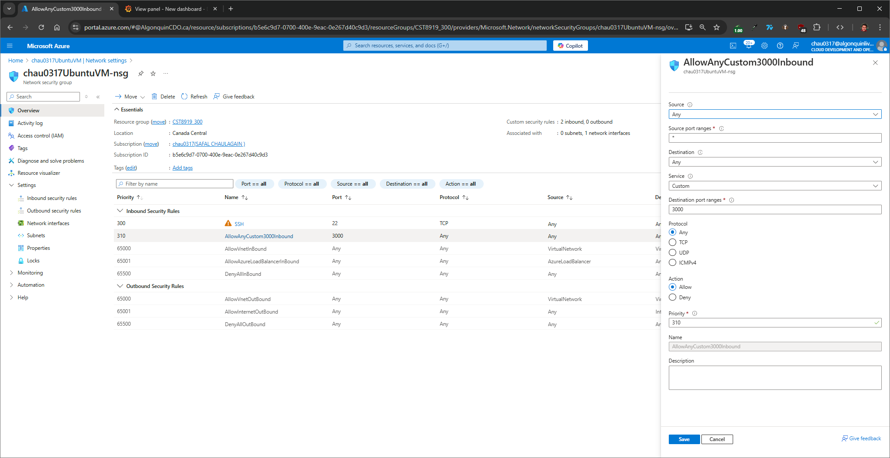
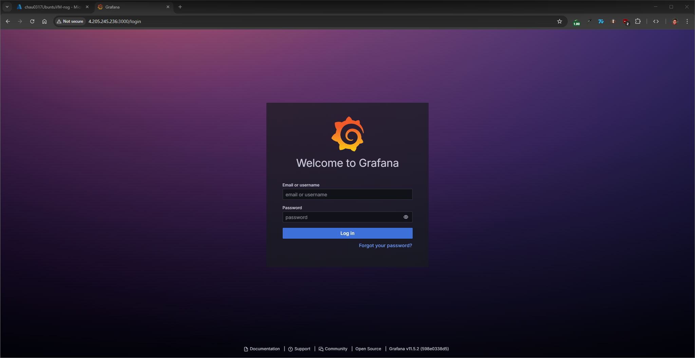
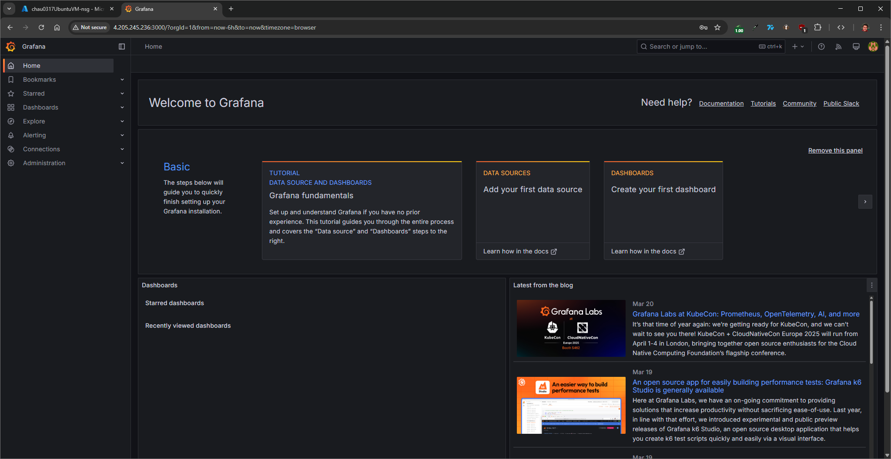
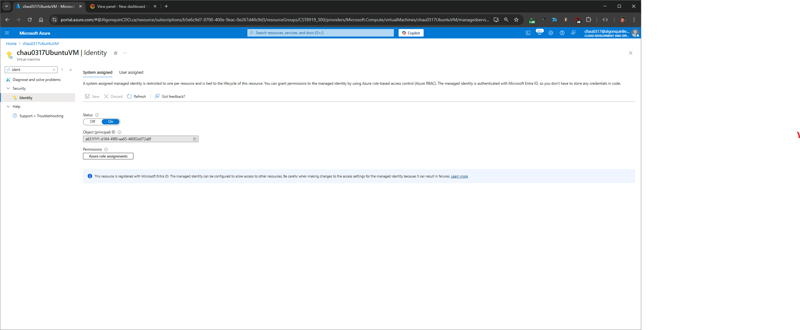
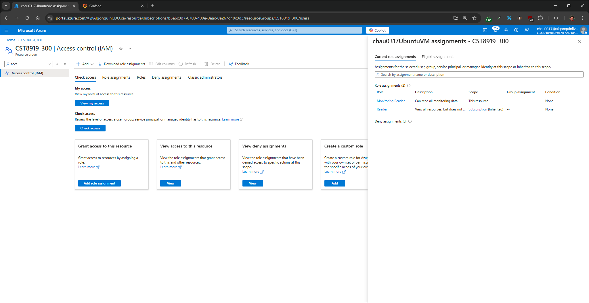
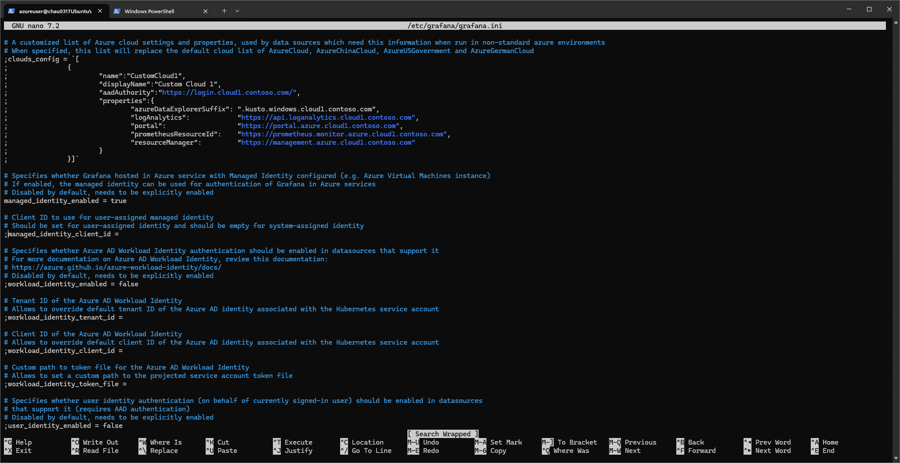
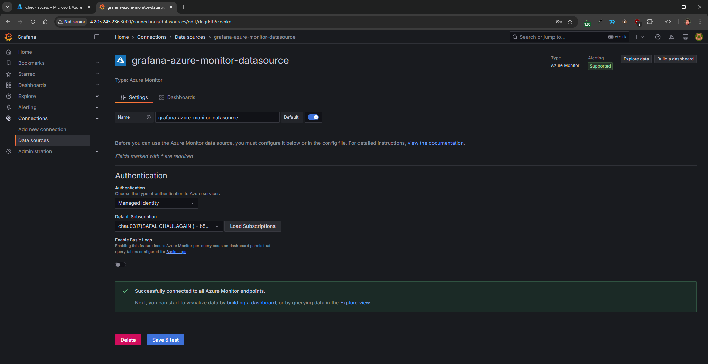
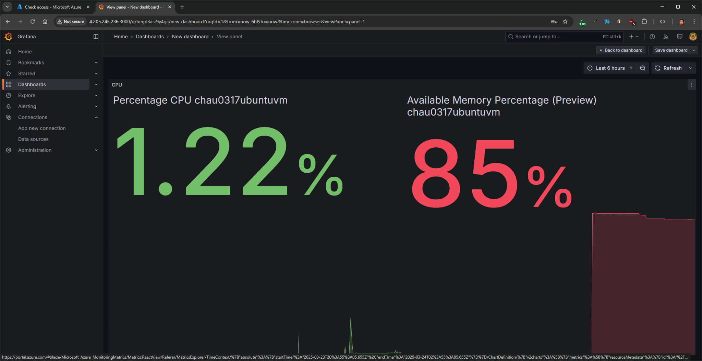

# Lab 3 Report: Grafana Installation & Dashboard for Ubuntu Server Performance

### **Objective**

The goal of this lab is to install and configure Grafana on an Ubuntu VM, connect it to Azure Monitor using Managed Identity, and create a custom dashboard to visualize performance metrics such as CPU usage, memory utilization, and network activity.

---

### **Steps Performed**

---

### **1: Prepare the Ubuntu Server**

- Used the existing Ubuntu VM named `chau0317UbuntuVM` from Lab 2.
- **Updated the system packages**:

```bash
sudo apt-get update && sudo apt-get upgrade -y
```

- Installed required dependencies.
- Added Grafana APT repository and GPG key.
- Installed Grafana and enabled it as a service.

```bash
sudo apt-get install -y apt-transport-https software-properties-common wget
sudo mkdir -p /etc/apt/keyrings/
wget -q -O - https://apt.grafana.com/gpg.key | gpg --dearmor | sudo tee /etc/apt/keyrings/grafana.gpg > /dev/null
echo "deb [signed-by=/etc/apt/keyrings/grafana.gpg] https://apt.grafana.com stable main" | sudo tee -a /etc/apt/sources.list.d/grafana.list
sudo apt-get update
sudo apt-get install grafana
```

- **Enabled & started Grafana:**

```bash
sudo systemctl daemon-reload
sudo systemctl start grafana-server
sudo systemctl enable grafana-server
```


- **Port 3000 was confirmed open** on the VM’s Network Security Group.



- **Accessed Grafana via browser:** `http://4.205.245.236:3000/`
  - Logged in with `admin/admin` and changed password.




---

### **3: Connect Grafana to Azure Monitor**

#### Step 1: Enable Managed Identity

1. Navigate to **Virtual Machines** in the Azure portal.
2. Select your VM: `chau0317UbuntuVM`.
3. Go to **Identity** in the left-hand menu.
4. Under **System assigned**, set **Status** to `On` and click \*\*Save`.



#### Step 2: Assign the Monitoring Reader Role

1. Go to **Resource groups** > Select the group containing your VM.
2. Click on **Access control (IAM)** > **+ Add** > **Add role assignment**.
3. Role: `Monitoring Reader`
4. Assign access to: `Managed Identity`
5. Select your VM: `chau0317UbuntuVM`
6. Click **Review + assign**

#### Step 3: Assign the Reader Role at Subscription Level

1. Go to **Subscriptions** in the Azure portal.
2. Select your subscription.
3. Click **Access control (IAM)** > **+ Add** > **Add role assignment**.
4. Role: `Reader`
5. Assign access to: `Managed Identity`
6. Select your VM: `chau0317UbuntuVM`
7. Click **Review + assign**



#### Step 4: Configure Grafana to Use Managed Identity

1. SSH into your VM.
2. Open the Grafana config file:

```bash
sudo nano /etc/grafana/grafana.ini
```

3. Locate the `[azure]` section and set:

```
[azure]
managed_identity_enabled = true
```



4. Restart Grafana:

```bash
sudo systemctl restart grafana-server
```

5. In Grafana web UI:

- Go to **Configuration > Data Sources**
- Add **Azure Monitor**
- Use **Managed Identity** for authentication
- Click **Save & Test**



---

### **4: Create Dashboard in Grafana**

- **Steps:**

  - Created a new dashboard
  - Added panels for:
    - CPU Utilization
    - Memory Usage

- **Used Azure Monitor as the data source**
  - Metrics from `chau0317UbuntuVM` were selected.



---

### **Conclusion**

Grafana was successfully installed and configured on `chau0317UbuntuVM`. A real-time dashboard visualizing Ubuntu performance metrics via Azure Monitor was created and is functioning as expected.
